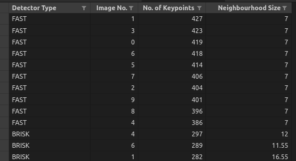
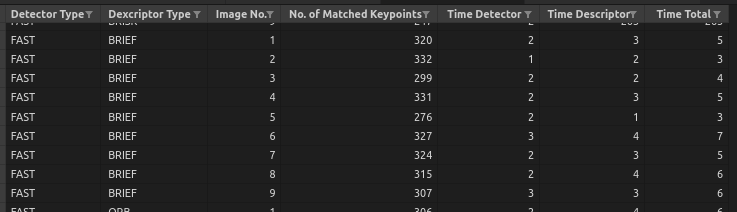

# SFND 2D Feature Tracking

The idea of the camera course is to build a collision detection system - that's the overall goal for the Final Project. As a preparation for this, you will now build the feature tracking part and test various detector / descriptor combinations to see which ones perform best. This mid-term project consists of four parts:

* First, you will focus on loading images, setting up data structures and putting everything into a ring buffer to optimize memory load. 
* Then, you will integrate several keypoint detectors such as HARRIS, FAST, BRISK and SIFT and compare them with regard to number of keypoints and speed. 
* In the next part, you will then focus on descriptor extraction and matching using brute force and also the FLANN approach we discussed in the previous lesson. 
* In the last part, once the code framework is complete, you will test the various algorithms in different combinations and compare them with regard to some performance measures. 

See the classroom instruction and code comments for more details on each of these parts. Once you are finished with this project, the keypoint matching part will be set up and you can proceed to the next lesson, where the focus is on integrating Lidar points and on object detection using deep-learning. 

## Dependencies for Running Locally
* cmake >= 2.8
  * All OSes: [click here for installation instructions](https://cmake.org/install/)
* make >= 4.1 (Linux, Mac), 3.81 (Windows)
  * Linux: make is installed by default on most Linux distros
  * Mac: [install Xcode command line tools to get make](https://developer.apple.com/xcode/features/)
  * Windows: [Click here for installation instructions](http://gnuwin32.sourceforge.net/packages/make.htm)
* OpenCV >= 4.1
  * This must be compiled from source using the `-D OPENCV_ENABLE_NONFREE=ON` cmake flag for testing the SIFT and SURF detectors.
  * The OpenCV 4.1.0 source code can be found [here](https://github.com/opencv/opencv/tree/4.1.0)
* gcc/g++ >= 5.4
  * Linux: gcc / g++ is installed by default on most Linux distros
  * Mac: same deal as make - [install Xcode command line tools](https://developer.apple.com/xcode/features/)
  * Windows: recommend using [MinGW](http://www.mingw.org/)

## Basic Build Instructions

1. Clone this repo.
2. Make a build directory in the top level directory: `mkdir build && cd build`
3. Compile: `cmake .. && make`
4. Run it: `./2D_feature_tracking`.

# MP.0 Mid-Term Report

## MP.1 Data Buffer Optimization

This task was achieved by a repeated check on the dataBuffer size and removing element from its beginning for each new element added if it exceeds the given limit.

## MP.2 Keypoint Detection

Implementation for the seven Keypoint detectors `{"SHITOMASI", "HARRIS", "FAST", "BRISK", "ORB", "AKAZE", "SIFT"}` is located in `matching2D_Student.cpp` in three functions `void detKeypointsShiTomasi`, `void detKeypointsHarris`, and `void detKeypointsModern`.

## MP.3 Keypoint Removal

This is done by checking on all keypoints if they lie within the coordinate boundaries of a given rectangle. Lines `112-121` of `MidtermProject_Camera_Student.cpp`.

## MP.4 Keypoint Descriptors

Implemented in function `void descKeypoints` in `matching2D_Student.cpp`.

## MP.5 Descriptor Matching

Implemented in function `void matchDescriptors` in `matching2D_Student.cpp`. First step we configure the matcher object to Bruteforce `MAT_BF` or flann matcher `MAT_FLANN`. 

## MP.6 Descriptor Distance Ratio

In the same previously mentioned function `void matchDescriptors`, matched keypoint pairs are filtered to include only whose distance ratio <0.8.

## MP.7 Performance Evaluation 1

Results in `stats/mp7.csv`.

`FAST` is the best detector with keypoints ~400 consistently.

## MP.8 Performance Evaluation 2

Results in `stats/mp89.csv`.

`FAST` detector with `BRIEF` descriptor is the best pair in terms of no. of matchings (~320).

## MP.9 Performance Evaluation 3

Results in `stats/mp89.csv`.

`FAST` detector with `BRIEF` descriptor is the best pair in terms of time total (~5 ms).

